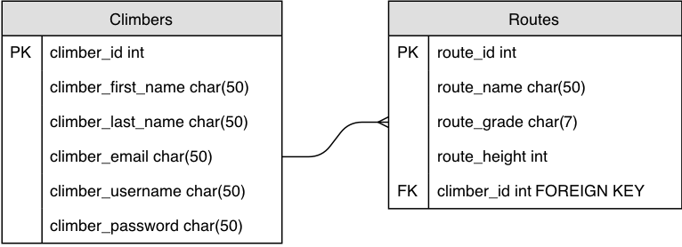

# A-SEND Backend

The code that holds the database for climbers and routes.   

## API: 

Climber Data: https://capstone-climb-db.herokuapp.com/climbers
Route Data: https://capstone-climb-db.herokuapp.com/routes

### Technologies 

Node.js, Express, Knex, Postman, and Javascript 

### Install

Fork & Clone Repo
npm install 

### GitHub Repos
Database: https://github.com/justcallmebeef/CapstoneProjectBE

### ERD 

## Author

* **Bethany Mitch** - *BM* - [justcallmebeef](https://github.com/justcallmebeef)